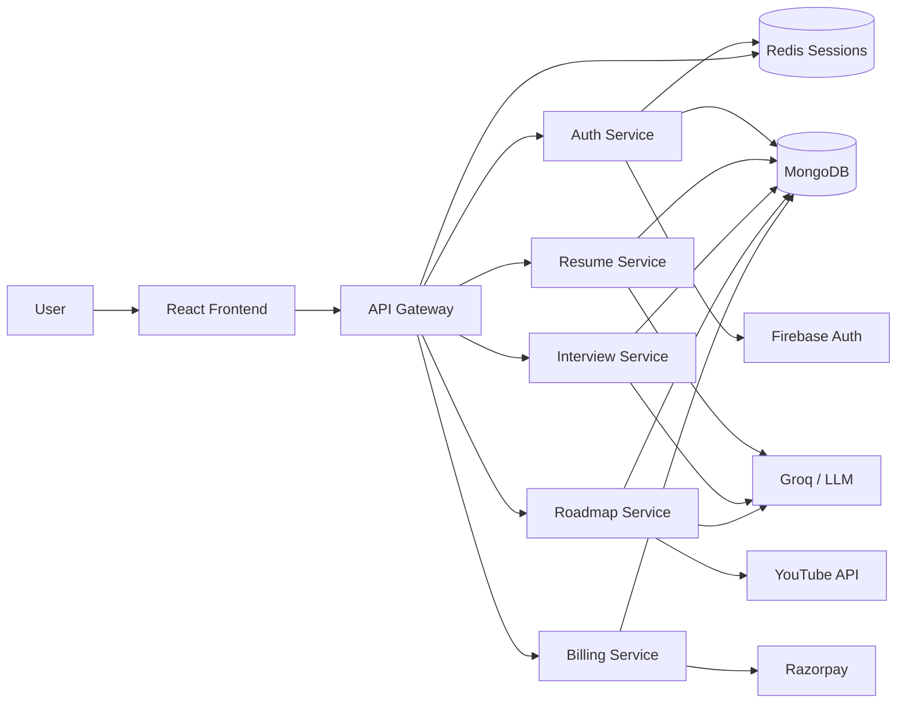

# Multi-Agent AI Interview Platform

An AI-powered career preparation platform that helps freshers practice interviews, analyze resumes, receive structured feedback, and generate personalized learning roadmaps.

FresherAI combines multiple AI agents with a scalable microservices backend to simulate real interview preparation workflows: resume understanding, question generation, answer evaluation, performance reporting, and roadmap planning.


## Highlights

- Multi-agent AI system for resume analysis, interview generation, answer feedback, and roadmap creation.
- Resume-aware interview simulation with role-specific HR and technical questions.
- AI feedback engine that scores answers across correctness, clarity, relevance, detail, efficiency, communication, problem solving, and creativity.
- Personalized roadmap generator using resume insights, target role, salary goal, official docs, and YouTube resources.
- Scalable microservice architecture with API gateway, Redis session cache, MongoDB persistence, and Dockerized services.
- Secure Google authentication powered by Firebase and server-side Redis sessions.
- Modern React dashboard for interview stats, skill charts, resume insights, and progress tracking.

## Demo Flow

1. Sign in with Google.
2. Upload a resume PDF for AI-powered ATS analysis.
3. Start an HR or technical mock interview.
4. Answer timed AI-generated questions using text, speech, or code editor.
5. Receive instant answer-level feedback.
6. View a final interview report with score, strengths, weaknesses, and recommendations.
7. Generate a personalized learning roadmap based on resume gaps and target role.

## Core AI Agents

| Agent | Responsibility |
| --- | --- |
| Resume Agent | Extracts resume data, ATS score, skills, missing skills, strengths, weaknesses, and suggested role. |
| Interview Agent | Generates realistic HR or technical interview questions based on role and optional resume context. |
| Feedback Agent | Evaluates every answer and returns score, feedback, and actionable improvements. |
| Summary Agent | Produces the final interview report after all questions are completed. |
| Roadmap Agent | Builds a personalized roadmap for a target role and package. |
| Resource Agent | Enriches roadmap modules with documentation/articles and YouTube resources. |

## Architecture



## Tech Stack

### Frontend

- React.js
- React Router
- Redux Toolkit
- Tailwind CSS
- Framer Motion / Motion
- Recharts
- Monaco Editor
- Firebase Client SDK

### Backend

- Node.js
- Express.js
- MongoDB + Mongoose
- Redis + ioredis
- LangChain
- LangGraph
- Groq LLM
- Firebase Admin SDK
- Razorpay
- Multer
- PDF parsing
- Docker

## Project Structure

```text
2.fresherAI/
  frontend/
    src/
      apis/
      assets/
      components/
      pages/
      redux/
      utils/
  backend/
    gateway/
    shared/
      redis/
    services/
      auth/
      billing/
      interview/
      resume/
      roadmap/
```

## Backend Services

| Service | Default Port | Purpose |
| --- | ---: | --- |
| Gateway | 6000 | Public API gateway, auth middleware, service proxying |
| Auth | 6001 | Firebase login, Redis sessions, user coins |
| Resume | 6002 | Resume upload, PDF parsing, AI resume analysis |
| Interview | 6003 | AI interview lifecycle, feedback, final reports |
| Roadmap | 6004 | Personalized roadmap generation and resources |
| Billing | 6005 | Razorpay order creation and payment verification |
| Redis | 6379 | Session and response caching |

## Environment Variables

Create `.env` files inside the respective service folders.

### Frontend

```env
VITE_BACKEND_URL=http://localhost:6000
VITE_FIREBASE_APIKEY=your_firebase_api_key
VITE_RAZORPAY_KEY_ID=your_razorpay_key_id
```

### Gateway

```env
PORT=6000
FRONTEND_URL=http://localhost:5173
REDIS_URL=redis://localhost:6379
AUTH_SERVICE_URL=http://localhost:6001
RESUME_SERVICE_URL=http://localhost:6002
INTERVIEW_SERVICE_URL=http://localhost:6003
ROADMAP_SERVICE_URL=http://localhost:6004
BILLING_SERVICE_URL=http://localhost:6005
```

### Common Service Variables

```env
PORT=service_port
MONGODB_URL=your_mongodb_connection_string
REDIS_URL=redis://localhost:6379
GROQ_API_KEY=your_groq_api_key
GROQ_MODEL=openai/gpt-oss-120b
```

### Roadmap Service

```env
YOUTUBE_API_KEY=your_youtube_api_key
```

### Billing Service

```env
RAZORPAY_KEY_ID=your_razorpay_key_id
RAZORPAY_KEY_SECRET=your_razorpay_key_secret
```

## Getting Started

### 1. Clone the repository

```bash
git clone https://github.com/zurakatsura-543/Multi-Agent-AI-Interview-Platform.git
cd Multi-Agent-AI-Interview-Platform/2.fresherAI
```

### 2. Start Redis

```bash
cd backend
docker compose up -d
```

### 3. Install dependencies

```bash
cd frontend
npm install

cd ../backend/gateway
npm install

cd ../services/auth
npm install

cd ../resume
npm install

cd ../interview
npm install

cd ../roadmap
npm install

cd ../billing
npm install
```

### 4. Run backend services

Open separate terminals for each service:

```bash
cd backend/gateway
npm run dev
```

```bash
cd backend/services/auth
npm run dev
```

```bash
cd backend/services/resume
npm run dev
```

```bash
cd backend/services/interview
npm run dev
```

```bash
cd backend/services/roadmap
npm run dev
```

```bash
cd backend/services/billing
npm run dev
```

### 5. Run frontend

```bash
cd frontend
npm run dev
```

Frontend runs on:

```text
http://localhost:5173
```

## Feature Breakdown

### AI Resume Analyzer

- Upload PDF resumes.
- Extract text using PDF parsing.
- Analyze candidate profile using an LLM.
- Generate ATS score, missing skills, role suggestions, strengths, weaknesses, and recommendations.
- Cache resume insights for reuse in interviews and roadmaps.

### AI Interview Simulator

- Choose target role and interview type.
- Generate six structured questions.
- Supports resume-aware personalization.
- Includes timer, speech synthesis, speech recognition, camera preview, and code editor.
- Provides feedback after each answer.
- Generates final performance report.

### AI Roadmap Generator

- Generates personalized learning paths based on target role and package.
- Uses resume gaps when available.
- Produces ordered modules with duration, difficulty, and descriptions.
- Adds articles/docs and YouTube resources for each module.

### Dashboard

- Tracks total interviews.
- Shows completed interviews and average score.
- Visualizes HR and technical performance across multiple skill dimensions.

### Billing and Coins

- Users receive free starter coins.
- AI features consume coins.
- Razorpay integration allows purchasing additional interview coins.

## Why This Project Stands Out

This is not a simple CRUD application. It combines AI orchestration, microservices, authentication, payments, caching, PDF processing, and real-time interview UX into one production-style platform.

The system demonstrates:

- Practical multi-agent AI architecture.
- Service separation and API gateway routing.
- AI output normalization and persistence.
- Redis-backed authentication sessions.
- Resume-aware personalization.
- Scalable backend design ready for cloud deployment.

## Future Improvements

- Add Kubernetes deployment manifests.
- Add CI/CD pipeline.
- Add automated backend tests.
- Add admin analytics dashboard.
- Add email reports after interviews.
- Add cloud storage for uploaded resumes.
- Add WebRTC-based live interview mode.

## Author

Built by [zurakatsura-543](https://github.com/zurakatsura-543)

## License

This project is open for learning and portfolio use. Add a license file before using it for commercial distribution.
